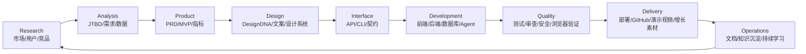

# Lifecycle Map

Super Skill 的核心不是简单收集技能，而是把技能放进一个“从不确定到交付”的闭环。

## 主闭环

## 横切能力

- `auto-flow`: 串联主闭环。
- `ralph-loop`: 对长任务执行小步循环和验证。
- `verification-loop`: 在完成声明前强制证据优先。
- `agent-routing`: 在直接编辑、工具、MCP、浏览器和子任务之间选择轻量路径。
- `cross-tool-packaging`: 将技能适配到不同 agent 生态。

## 领域生态

`vendor/cowork/` 覆盖法律、财务、营销、销售、客服、企业搜索、数据、生物科研、生产力等领域。它们目前以 vendor form 保留，后续可以按 `domain-skill-name` 命名空间化后纳入 installable skills。
