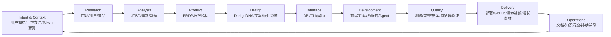

# Lifecycle Map

Super Skill 的核心不是简单收集技能，而是把技能放进一个“从用户期待到可验证交付”的闭环。

## 主闭环

## 横切能力

- `intent-contract`: 把用户期待变成验收契约。
- `context-engineering`: 为大上下文和长任务构造最小充分上下文包。
- `prompt-cache-layering`: 区分稳定提示层与临时任务层，保护缓存和压缩质量。
- `token-budgeting`: 保留高信号上下文，减少重复和噪声。
- `persistent-memory-curation`: 决定什么进入长期记忆、会话搜索、项目上下文或技能。
- `skill-evolution-loop`: 从成功经验和失败模式中演进技能。
- `skill-composition`: 决定多技能的触发顺序、共享工件交接与冲突处理（frame → build → gate）。
- `auto-flow`: 串联主闭环。
- `ralph-loop`: 对长任务执行小步循环和验证。
- `durable-agent-board`: 把跨角色、可恢复、需人工解锁的任务放进持久队列。
- `toolset-sandbox-routing`: 为任务选择最小工具集、沙箱、审批和模型路由。
- `checkpoint-rollback-safety`: 在风险编辑前建立 checkpoint、worktree 或恢复路径。
- `verification-loop`: 在完成声明前强制证据优先。
- `output-quality-gate`: 在最终交付前检查输出是否满足用户期待。
- `agent-routing`: 在直接编辑、工具、MCP、浏览器和子任务之间选择轻量路径。
- `cross-tool-packaging`: 将技能适配到不同 agent 生态。

## 领域生态

`vendor/cowork/` 覆盖法律、财务、营销、销售、客服、企业搜索、数据、生物科研、生产力等领域。它们目前以 vendor form 保留，后续可以按 `domain-skill-name` 命名空间化后纳入 installable skills。
