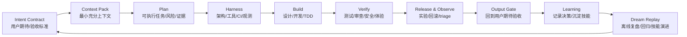

# Agentic Development Model

Super Skill 的核心目标不是让 LLM 多输出内容，而是让 AI agent 更稳定地交付用户真正期待的结果。项目能力的关键不只是模型，而是 harness + self-improving loop：让 agent 能看懂系统、适配开发工具、约束模型输入输出、运行验证、发布实验、观察生产、压缩上下文、沉淀记忆、离线 replay、演进技能并安全回滚。

## Operating Loop

## What Changes

Traditional development asks: "What code should we write?"

Agentic development asks:

- What user outcome are we trying to make true?
- What is the smallest context package that lets the agent act correctly?
- What contract will the output be judged against?
- Which evidence proves the result?
- What harness capability is missing if the agent fails?
- What should be remembered, and what should be discarded to save context?
- What should become memory, searchable history, project context, a skill, a test, or an automation?
- Which developer tool adapter and model contract are needed for this task?
- Which past experience should be replayed offline before becoming durable memory?

## Skill Layers

| Layer | Skill | Purpose |
| --- | --- | --- |
| Intent | `intent-contract` | Turn broad user wishes into acceptance criteria and output shape. |
| Context | `context-engineering` | Build compact context packs for large codebases and long tasks. |
| Tooling | `dev-tool-adapter` | Adapt one canonical skill set to Cursor, Trae, OpenCode, OpenClaw, Claude Code, Codex, and future runtimes. |
| Model | `model-adaptation-contract` | Keep model routing, input contracts, output schemas, fallback policy, and eval gates provider-neutral. |
| Harness | `harness-engineering`, `agent-legible-architecture` | Make the project inspectable, enforceable, testable, and operable by agents. |
| Hermes Loop | `persistent-memory-curation`, `prompt-cache-layering`, `toolset-sandbox-routing`, `durable-agent-board`, `checkpoint-rollback-safety` | Keep long sessions efficient, preserve durable knowledge, route tools safely, and coordinate work beyond one turn. |
| Execution | `auto-flow`, `design-dev-flow`, `test-driven-development` | Move from idea to implementation with staged verification. |
| Quality | `ai-review-gates`, `qa-strategy`, `verification-loop`, `output-quality-gate` | Prove behavior and user-expectation fit before delivery. |
| Delivery | `agentic-product-iteration`, `experiment-driven-delivery` | Ship behind metrics, flags, kill switches, and decision rules. |
| Operations | `observability-triage-loop` | Convert production signals into clustered investigation and re-verification loops. |
| Economy | `token-budgeting` | Keep the right context alive while reducing noise and repeated tokens. |
| Learning | `agent-memory-dream-loop`, `continuous-learning`, `skill-authoring-system`, `skill-evolution-loop` | Convert repeated wins and failures into better future memory, docs, tests, skills, evals, dream replay, and automation. |

## Design Principles

- **User expectation first**: a good answer is measured against the user's desired outcome, not the model's fluency.
- **Context as product**: context is designed, versioned, compressed, and handed off like a real artifact.
- **Evidence before claims**: output quality depends on proof, not confidence.
- **Progressive disclosure**: keep core guidance small; load references only when needed.
- **Small reversible steps**: agent work should be easy to review, rerun, or roll back.
- **Token economy**: bigger context helps only when the signal-to-noise ratio stays high.
- **Memory with evidence**: durable memory must have source, scope, expiry, and verification.
- **Adapter over fork**: support more tools by wrapping canonical skills, not by copying divergent instructions.

## Default Project Flow

1. Start with `intent-contract`.
2. Build a `context-engineering` pack.
3. Use the lifecycle skills from research through delivery.
4. Use `token-budgeting` whenever source material grows.
5. Use `dev-tool-adapter` when moving between Cursor, Trae, OpenCode, OpenClaw, Claude Code, Codex, or another runtime.
6. Use `model-adaptation-contract` before changing models or provider routes.
7. Use `harness-engineering` when an agent failure reveals a missing capability.
8. Use `prompt-cache-layering` and `persistent-memory-curation` when context or memory pressure rises.
9. Use `durable-agent-board` when work must survive restarts, human unblock, or multi-role handoffs.
10. Use `checkpoint-rollback-safety` before risky generated edits or broad refactors.
11. Use `output-quality-gate` before final response, commit, PR, or handoff.
12. Store reusable lessons through `agent-memory-dream-loop`, `skill-evolution-loop`, `skill-authoring-system`, or `continuous-learning`.
