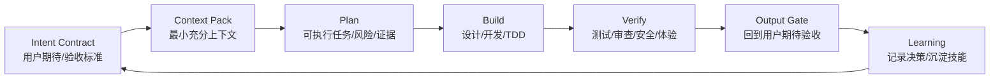

# Agentic Development Model

Super Skill 的核心目标不是让 LLM 多输出内容，而是让 AI agent 更稳定地交付用户真正期待的结果。

## Operating Loop

## What Changes

Traditional development asks: "What code should we write?"

Agentic development asks:

- What user outcome are we trying to make true?
- What is the smallest context package that lets the agent act correctly?
- What contract will the output be judged against?
- Which evidence proves the result?
- What should be remembered, and what should be discarded to save context?

## Skill Layers

| Layer | Skill | Purpose |
| --- | --- | --- |
| Intent | `intent-contract` | Turn broad user wishes into acceptance criteria and output shape. |
| Context | `context-engineering` | Build compact context packs for large codebases and long tasks. |
| Execution | `auto-flow`, `design-dev-flow`, `test-driven-development` | Move from idea to implementation with staged verification. |
| Quality | `qa-strategy`, `verification-loop`, `output-quality-gate` | Prove behavior and user-expectation fit before delivery. |
| Economy | `token-budgeting` | Keep the right context alive while reducing noise and repeated tokens. |
| Learning | `continuous-learning`, `skill-authoring-system` | Convert repeated wins and failures into better future skills. |

## Design Principles

- **User expectation first**: a good answer is measured against the user's desired outcome, not the model's fluency.
- **Context as product**: context is designed, versioned, compressed, and handed off like a real artifact.
- **Evidence before claims**: output quality depends on proof, not confidence.
- **Progressive disclosure**: keep core guidance small; load references only when needed.
- **Small reversible steps**: agent work should be easy to review, rerun, or roll back.
- **Token economy**: bigger context helps only when the signal-to-noise ratio stays high.

## Default Project Flow

1. Start with `intent-contract`.
2. Build a `context-engineering` pack.
3. Use the lifecycle skills from research through delivery.
4. Use `token-budgeting` whenever source material grows.
5. Use `output-quality-gate` before final response, commit, PR, or handoff.
6. Store reusable lessons through `skill-authoring-system` or `continuous-learning`.
