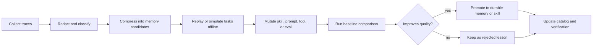

# Agent Memory Dream Loop

Use this skill when the project needs better agent memory, experience reuse, offline reflection, or a self-improving loop that turns past work into better future performance.

Memory is not a larger prompt. Memory is a governed system for deciding what should be recalled, compressed, evaluated, forgotten, or promoted into skills and tests.

## Memory Tiers

| Tier | Purpose | Storage Shape | Load Policy |
| --- | --- | --- | --- |
| Episodic traces | What happened in a session | logs, diffs, commands, errors, review notes | Retrieve on demand by task, file, error, or decision. |
| Semantic memory | Durable facts and decisions | concise notes with source and date | Load when relevant to the current project or user goal. |
| Procedural memory | How to do repeatable work | skills, runbooks, scripts, checklists | Promote only after repeated usefulness and verification. |
| Evaluation memory | What proves quality | tests, evals, rubrics, benchmarks | Load before model or workflow changes. |
| Negative memory | What failed or was rejected | short anti-pattern records | Load as warnings, not as full transcripts. |

## Dream Loop

Run the dream loop during low-risk offline time, after incidents, or after repeated agent failures.



## Promotion Criteria

A memory candidate can be promoted only when:

- it has source evidence
- secrets and private data have been removed
- it is shorter than the raw trace
- it is still true for the current project
- it improves at least one eval, test, or review rubric
- it does not conflict with higher-priority instructions
- it has an owner or expiry rule

## Memory Record Format

```text
Type: semantic | procedural | evaluation | negative
Scope: user | project | skill | runtime | model
Source:
Date:
Claim:
Evidence:
Use when:
Do not use when:
Expiry:
Promotion target:
Verification:
```

## Safety Rules

- Never store secrets, credentials, private keys, auth tokens, personal identifiers, or raw customer data.
- Do not memorize a model claim unless it is verified by source, test, or human decision.
- Prefer deletion or expiry over permanent accumulation.
- Keep raw traces out of always-on context.
- Preserve rejected alternatives when they prevent repeated waste.
- Mark stale memories instead of silently reusing them.

## Harness Integration

If an agent fails, do not just ask the model to try harder. Ask:

1. Which memory was missing?
2. Which memory was stale or harmful?
3. Which skill should have been selected?
4. Which test or eval should have caught this?
5. Which runtime wrapper or tool permission made the task illegible?
6. Which negative lesson should stop this failure from repeating?

The output should be one small artifact: a memory record, skill patch, eval case, runbook note, or rejection note.
