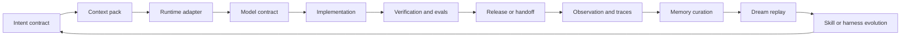
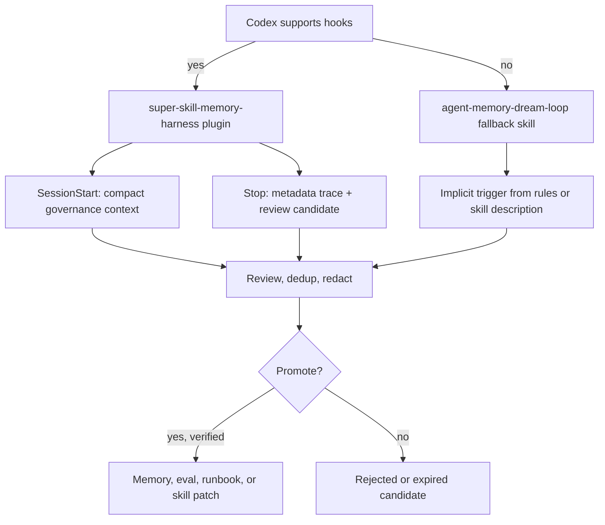

# Adaptive Agent Memory Harness Loop

Use this workflow when an AI-first project must support multiple developer tools, multiple LLMs, and durable learning without losing token efficiency.

## Loop

## Auto-Trigger Layer

Automatic does not mean uncontrolled. The trigger policy lives in `manifests/auto-trigger-policy.json`; the skill lifecycle policy lives in `manifests/skill-lifecycle-policy.json`.

## Steps

1. Define the user expectation with `intent-contract`.
2. Build the smallest useful context with `context-engineering` and `token-budgeting`.
3. Select the runtime adapter with `dev-tool-adapter`.
4. If the runtime supports plugins/hooks, install `super-skill-memory-harness`; otherwise configure the `agent-memory-dream-loop` fallback trigger.
5. Select or validate the model profile with `model-adaptation-contract`.
6. Execute through the normal design, development, test, delivery, and operations skills.
7. Run the relevant CLI checks: `validate`, `audit`, `harness`, `hermes`, `memory`, and `triggers`.
8. Store only verified lessons through `agent-memory-dream-loop`.
9. Promote repeated lessons into existing skills, evals, docs, or runbooks before creating new skills.

## Completion Gate

The workflow is complete only when:

- runtime adapter target and verification command are recorded
- model profile and output contract are explicit
- token budget and context reuse plan are explicit
- verification evidence exists
- automatic trigger path and off switch are explicit
- reusable experience is either promoted or deliberately rejected
- no raw secrets, private data, or stale unverified memories are stored
- skill evolution has passed dedup, protected-skill, and reversible archive constraints
