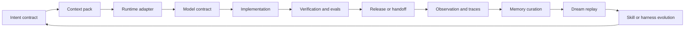

# Adaptive Agent Memory Harness Loop

Use this workflow when an AI-first project must support multiple developer tools, multiple LLMs, and durable learning without losing token efficiency.

## Loop

## Steps

1. Define the user expectation with `intent-contract`.
2. Build the smallest useful context with `context-engineering` and `token-budgeting`.
3. Select the runtime adapter with `dev-tool-adapter`.
4. Select or validate the model profile with `model-adaptation-contract`.
5. Execute through the normal design, development, test, delivery, and operations skills.
6. Run the relevant CLI checks: `validate`, `audit`, `harness`, `hermes`, and `memory`.
7. Store only verified lessons through `agent-memory-dream-loop`.
8. Promote repeated lessons into skills, evals, docs, or runbooks.

## Completion Gate

The workflow is complete only when:

- runtime adapter target and verification command are recorded
- model profile and output contract are explicit
- token budget and context reuse plan are explicit
- verification evidence exists
- reusable experience is either promoted or deliberately rejected
- no raw secrets, private data, or stale unverified memories are stored
